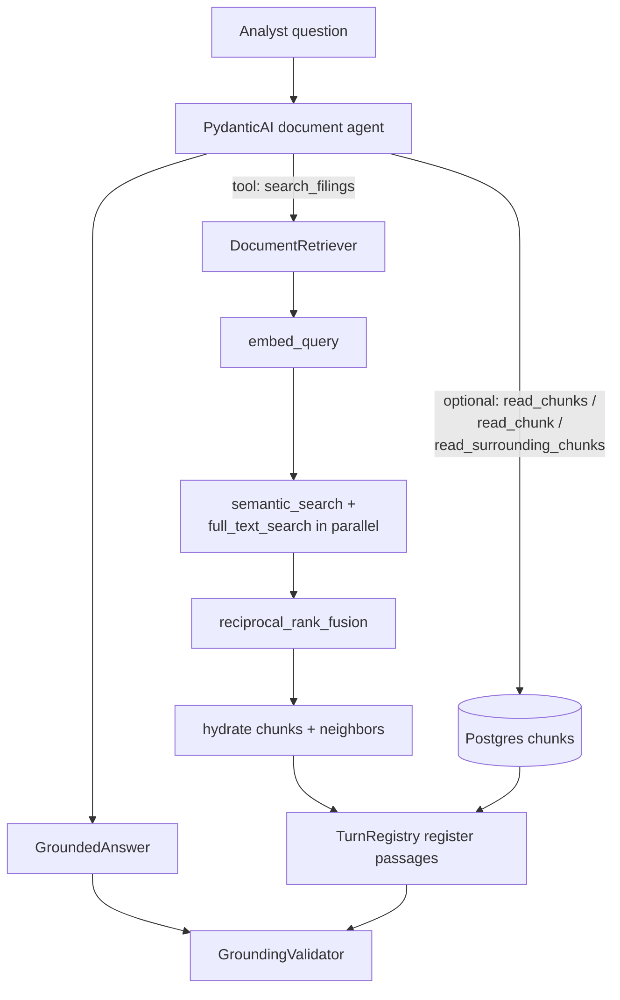

# Research pipeline: retrieval → agent → grounding

End-to-end flow for answering analyst questions from SEC filing chunks. Retrieval finds candidate passages; the PydanticAI agent reads them via tools and produces a structured answer; grounding validates that every citation is real before the response is shown or persisted.

Retrieval-specific settings and SQL details live in `../retrieval/README.md`.

## Full pipeline

## Step-by-step flow

1. **Analyst question**: The analyst submits a research question via the chat interface or test script.
2. **PydanticAI document agent**: Guided by `instructions.md`, the agent analyzes the question and determines which retrieval tools to call.
3. **Retrieval (`search_filings`)**:
   - `embed_query`: Vectorizes the search query via OpenAI `text-embedding-3-small`.
   - `semantic_search + full_text_search in parallel`: Runs dense `pgvector` and sparse PostgreSQL full-text search.
   - `reciprocal_rank_fusion`: Combines and ranks top candidates with RRF ($k=60$).
   - `hydrate chunks + neighbors`: Loads full passage text and adjacent context windows.
   - `TurnRegistry register passages`: Caches every retrieved chunk ID and verbatim text into the turn's registry.
4. **Direct chunk inspection (`read_chunks`, `read_chunk`, `read_surrounding_chunks`)**: Fetches specific chunks directly from PostgreSQL and registers them in `TurnRegistry`.
5. **Structured output (`GroundedAnswer`)**: The agent generates an analyst-grade answer with inline citation tags (`[1]`, `[2]`) linked to verified chunk IDs and verbatim excerpts.
6. **Grounding validation (`GroundingValidator`)**: Evaluates every citation against `TurnRegistry` passages to ensure zero hallucinations before responses are displayed or persisted.
