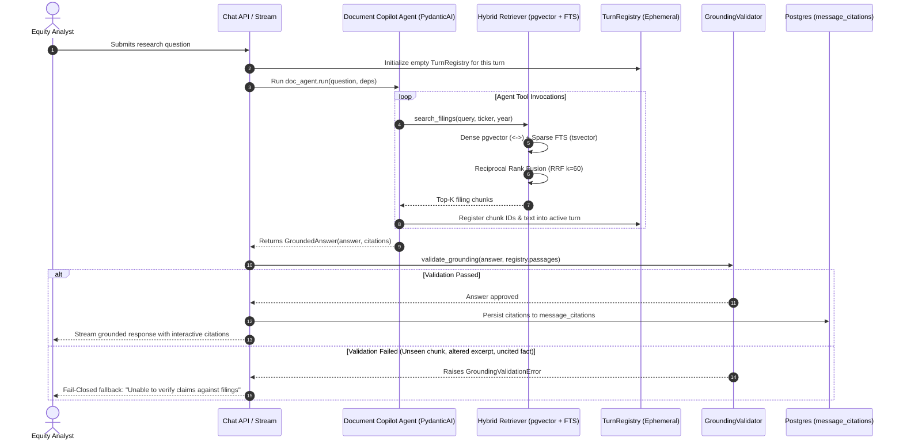

# Grounding & Verification Architecture

The `app.grounding` package implements Driftwood Capital's **Zero-Hallucination Trust Contract** for Document Copilot. It ensures that every claim made by the assistant is strictly substantiated by retrieved SEC filings (`10-K` / `10-Q`), with verifiable citations and verbatim excerpts.

---

## 1. End-to-End Pipeline Overview

---

## 2. How the Retrieval Pipeline Works

The agent uses a two-stage **Hybrid Retrieval** architecture documented in [`app/retrieval/README.md`](../retrieval/README.md):

1. **Query Embedding**: The natural language question is embedded into a 1536-dimensional vector using OpenAI's `text-embedding-3-small`.
2. **Dense Semantic Search**: Cosine distance search over `document_chunks.embedding` using PostgreSQL `pgvector`. Catches conceptual matches even when keywords differ.
3. **Sparse Lexical Search**: Full-text search using PostgreSQL `tsvector` with `websearch_to_tsquery('english', ...)`. Matches exact financial figures, tickers, and filing section titles.
4. **Reciprocal Rank Fusion (RRF)**:
   $$\text{RRF Score}(d) = \sum_{m \in \{\text{semantic}, \text{keyword}\}} \frac{1}{60 + \text{rank}_m(d)}$$
   Fuses both candidate lists to eliminate single-retriever bias.
5. **Surrounding Context Windows**: The agent can call `read_surrounding_chunks(chunk_id, window=1)` to expand context before and after any target chunk within the same filing.

---

## 3. How Grounding Works

Grounding is the verification firewall that sits between the LLM and the analyst. The agent cannot simply output text; it must produce a strongly typed `GroundedAnswer` whose citations are mathematically verified against chunks retrieved during that specific active turn.

### The Turn Registry (`TurnRegistry`)
Every turn creates an ephemeral `TurnRegistry`. Whenever the agent retrieves chunks via `search_filings`, `read_chunk`, or `read_surrounding_chunks`, the chunks are immediately recorded in `registry.passages[chunk.id]`. 

Citing any chunk not in `TurnRegistry` is treated as a hallucination.

### Fail-Closed Validation Rules

The `GroundingValidator` enforces six non-negotiable rules:

| Rule | Description | Failure Behavior |
| :--- | :--- | :--- |
| **Rule 1: Unseen Document Rejection** | Every citation must reference a `chunk_id` present in the current turn's `TurnRegistry`. | Fails closed with `GroundingValidationError`. The agent cannot invent UUIDs or cite chunks from prior turns. |
| **Rule 2: Verbatim Excerpt Verification** | Every citation must include an `excerpt` string that exists verbatim (or normalized) in the chunk text. | Substring match verified via exact matching, normalized whitespace, and sliding 5-word n-gram overlap. |
| **Rule 3: Uncited Factual Assertions** | Factual statements must have at least one citation. An uncited factual response is rejected. | Rejects responses that answer factually without attaching citations. |
| **Rule 4: Metadata Integrity** | Every citation must specify `ticker`, `form` (`10-K` / `10-Q`), and `filing_date`. | Enforces complete audit trail for analysts to verify against EDGAR. |
| **Rule 5: Insufficient Evidence Bypass** | If the SEC filings lack information, the agent can reply with `insufficient_evidence=True` (or refusal phrases) without citations. | Allowed without citations if phrasing matches recognized lack-of-evidence patterns. |
| **Rule 6: Question 10 GenAI Margin Rule** | The agent must refuse to extrapolate or claim that Generative AI improved margins unless explicitly quantified by the company. | Mandated by Driftwood compliance: no speculative extrapolation. |

---

## 4. Parallelization & Performance Optimizations

To minimize latency across multi-step research queries:

1. **Parallel LLM API Invocations (`asyncio.gather`)**:
   - In benchmarking and multi-company research (e.g. comparing AAPL, NVDA, and MSFT across years), queries are fired concurrently using `asyncio.gather`.
   - Total latency drops from $O(N \times T)$ down to $O(\max(T))$.
2. **Parallel Tool Execution**:
   - PydanticAI automatically executes multiple tool calls in parallel when the LLM issues concurrent tool calls (e.g. searching 2023 and 2024 filings simultaneously).
3. **Database Candidate Parallelism**:
   - Candidate generation uses indexed PostgreSQL queries (`pgvector` HNSW index + `tsvector` GIN index) ensuring sub-50ms search times per retriever.
