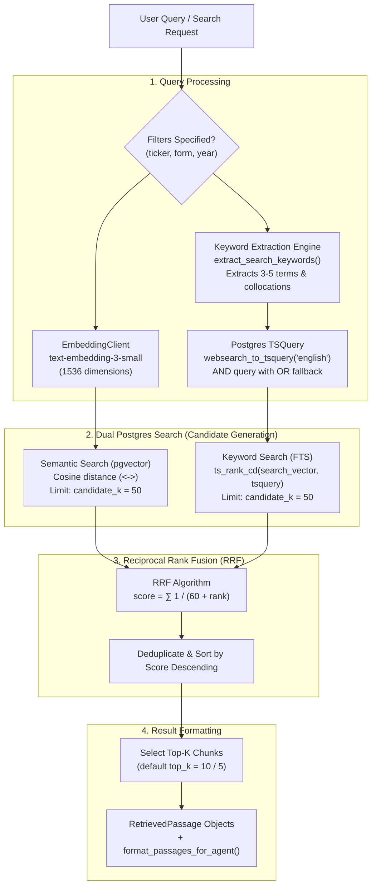

# Hybrid Retrieval Pipeline

The `app.retrieval` package implements a production-grade **Hybrid Search** engine combining dense semantic search (via `pgvector`) and sparse lexical full-text search (via PostgreSQL `tsvector`), unified by **Reciprocal Rank Fusion (RRF)**.

---

## Pipeline Architecture



---

## How It Works

1. **Keyword Extraction (3 to 5 Terms)**: Long conversational analyst questions (e.g. *"Across Apple's 10-Ks, how did the revenue mix between iPhone, Services, Mac, iPad, and Wearables change?"*) will match zero chunks if submitted verbatim to PostgreSQL `websearch_to_tsquery` because unquoted words are treated as strict `AND` requirements. The extraction engine:
   - Preserves high-signal multi-word financial collocations (e.g. `"revenue mix"`, `"data center"`, `"ai infrastructure"`).
   - Strips conversational stop words, filing labels (`10-K`, `10-Ks`), and fiscal years.
   - Applies ticker-aware deduplication (e.g. filters out redundant company names when `ticker="AAPL"` is already active).
   - Yields 3 to 5 targeted terms.
2. **Query Embedding**: The incoming natural language query is passed to `EmbeddingClient`, generating a 1536-dimensional vector using OpenAI's `text-embedding-3-small`.
3. **Semantic Search**: Scans `document_chunks` using pgvector cosine distance (`<->`) to find conceptually related text, even without exact keyword matches.
4. **Full-Text Keyword Search with Fallback**:
   - Executes strict `AND` search with `websearch_to_tsquery('english', and_query)`.
   - If strict `AND` yields 0 hits, automatically relaxes to `or_query` with `ts_rank_cd` proximity ranking so chunks containing multiple keywords surface at the top.
5. **Metadata Filtering**: Both searches optionally filter by company `ticker`, filing `form` (e.g. 10-K, 10-Q), and fiscal `year`.
6. **Reciprocal Rank Fusion (RRF)**:
   $$\text{RRF Score}(d) = \sum_{m \in M} \frac{1}{k + r_m(d)}$$
   Where $r_m(d)$ is the rank of document $d$ in retrieval method $m$, and $k = 60$. Chunks appearing near the top of both lists receive the highest priority.
7. **Top-K Selection**: The fused candidates are sliced to `top_k` results and returned as structured chunks or `RetrievedPassage` records.

---

## Default Settings & Parameters

| Parameter | Default Value | Location | Description |
| :--- | :--- | :--- | :--- |
| `max_terms` | `5` (min 3) | `keywords.py` | Maximum high-signal terms/collocations extracted from the user query for FTS. |
| `candidate_k` | `50` | `retriever.py` | Maximum candidate chunks retrieved per individual search method before fusion. |
| `top_k` | `10` (or `5`) | `retriever.py` | Number of final fused passages returned to the caller or LLM agent. |
| `RRF constant (k)` | `60` | `fusion.py` | Standard RRF smoothing constant that prevents outliers from dominating rankings. |
| `embedding_model` | `text-embedding-3-small` | `config.py` | OpenAI embedding model used to vectorize queries. |
| `embedding_dimensions` | `1536` | `config.py` | Vector dimensionality matching the database `Vector(1536)` column. |
| `fts_language` | `'english'` | `queries.py` | PostgreSQL text search dictionary used for stemming and stop words. |
| `context_window` | `1` | `queries.py` | Number of adjacent chunks fetched before and after a hit via `get_surrounding_chunks`. |

---

## Code Example

```python
from app.retrieval.retriever import DocumentRetriever
from app.retrieval.types import SearchFilters, format_passages_for_agent

# Initialize retriever (automatically connects to SessionLocal if session is omitted)
retriever = DocumentRetriever()

# 1. Inspect extracted keywords
keywords = retriever.extract_keywords("How did Data Center revenue and supply constraints change?", ticker="NVDA")
print(f"Extracted FTS Keywords: {keywords}")
# Output: ['"data center"', '"capacity constraints"', 'revenue', 'supply']

# 2. Search with filters
passages = retriever.search(
    query="How did Data Center revenue and supply constraints change?",
    filters=SearchFilters(ticker="NVDA", form="10-K"),
    top_k=5,
)

# 3. Format passages for display or prompt injection
print(format_passages_for_agent(passages))
```

---

## Key Files

- [`retriever.py`](retriever.py) — Main `DocumentRetriever` orchestrating keyword extraction, search, candidate generation, and fusion.
- [`keywords.py`](keywords.py) — 3–5 term keyword extraction engine, financial phrase collocations, and FTS query builders.
- [`fusion.py`](fusion.py) — Reciprocal Rank Fusion implementation.
- [`queries.py`](queries.py) — SQLAlchemy queries for pgvector distance, full-text tsquery with AND/OR fallback, and chunk context expansion.
- [`embeddings.py`](embeddings.py) — OpenAI embedding client with automatic retry logic.
- [`types.py`](types.py) — Data models (`SearchFilters`, `RetrievedPassage`, `RankedChunkHit`) and formatting helpers.
